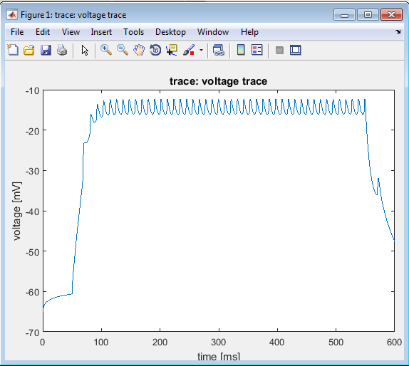

# Recording Cell Compartment Voltage Values


We wil be using the neuron module with python. See [here](README.md) for getting setup.


We are going to be running a neuron simulation in python and we will be recording voltage values from the cell compartments. 

In order to use the Neuron module, we are going to import an important variable using the following line:

`from neuron import h`

The `h` variable will be our HocObject. It allows python to interface with hoc. ([Using the h variable](https://www.neuron.yale.edu/neuron/static/py_doc/programming/python.html#python-accessing-hoc) )

After importing our HocObject we then need to load important files in hoc using the following lines of code:

```python
h('load_file("inc-first.ses")')  #load ion channels
h('{load_file("neuron-CB-ext-axon-2pieces-chans-ext-axon-70um.ses")}')  #load cellbuilder
h('load_file("fitfuncs.hoc")')  #load common functions
h('load_file("stats.hoc")')
```

Our simulation has to run for a certain duration, so let's set that duration to 600 milliseconds. We will be setting this duration in the `h` variables `tstop` attribute. simply call:

`h.tstop = 600`

We will be recording the voltage values in a hoc vector, so let's declare our vector and tell it what to record during the simulation.


```python
h('objref vec')
h('vec = new Vector()')
h('vec.record(&soma[0].v(.5))')
```


There's just one more thing we can do before running our simulation. We can attach a current clamp to stimulate the model using the following lines:

```python
#A current clamp to stimulate the model
clamp = h.IClamp(h.electrode(1)) 
clamp.delay = 50  #delay for 50 ms
clamp.dur= 500  #for the duration of 500 ms
clamp.amp = 0.05  #with an amplitude of 0.05 nA
```


Now that the preliminary steps have been taken, we can now run our simulation with the following lines:


```python
h.finitialize()  #Must be called before run().
h.run()  #Run simulation.
```

Once our simulation ends we can view our values in Matlab. But first, we have to write our data to a text file called `voltage_recording.txt` In order to do that, use the following lines:


```python
h('strdef my_file')
h('my_file = "voltage_recording.txt"')
h('objref save')
h('save = new File(my_file)')
h.save.wopen()
n = h.vec.vwrite(h.save)
if n ==1:
    h.save.close()
```
 
    
    
 ## Viewing Voltage Values in Matlab with Pandora ToolBox
 
 First, you will need the [Pandora ToolBox](https://github.com/cengique/pandora-matlab)
 
Simply load the `voltage_recording.txt` file in matlab and type the following line:

`a_trace = trace('voltage_recording.txt', 25e-6, 1e-3,'my_trace',struct('file_type','neuron')); plot(a_trace)`
 




